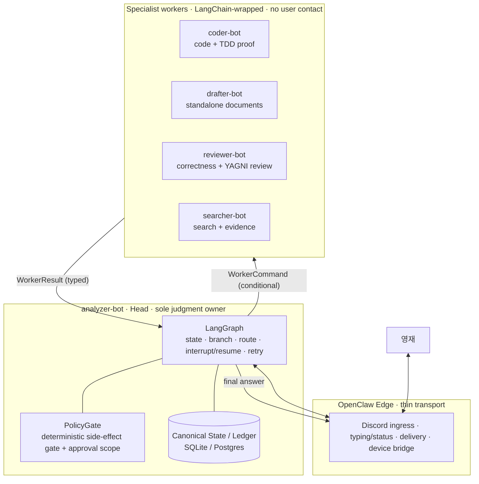

# analyzer-bot Orchestration Contracts

Date: 2026-08-01
Status: v0.1 design lock — structure confirmed, wiring spec added
Decision: single judgment owner (`analyzer-bot`) + four conditional workers, typed contracts, deterministic policy gate

## One-Line Decision

`analyzer-bot` is the only agent that talks to the user, forms intent, plans,
routes, verifies, and writes the final answer. `coder-bot`, `drafter-bot`,
`reviewer-bot`, and `searcher-bot` are stateless specialist workers that never
talk to the user and only return structured results. LangGraph conducts;
LangChain only wraps each worker into a callable part.

## Why This Supersedes The Old Worker List

The earlier `README.md` split conversation (OpenClaw Conversation Agent) from a
separate **Team Lead Planner**, plus Codex / Hermes / Apify / Critic / Tester /
Device / Operator. `docs/2026-07-31-langgraph-head-reference-patterns.md`
already retired that split:

> Keep LangGraph Head as the only conversation and judgment owner ... Keep out
> of v0.1: Team Lead Planner as a separate agent.

The `analyzer-bot` model is that same conclusion, named for how the user
actually experiences it. Removing `talk-advisor` and folding planning into
`analyzer-bot` is **correct** and needs no reversal.

### Name Reconciliation

| New name        | Old README role(s)                          | Status in v0.1 |
| --------------- | ------------------------------------------- | -------------- |
| `analyzer-bot`  | OpenClaw Conversation Agent + LangGraph Head + Team Lead Planner (merged) | Sole judgment owner |
| `coder-bot`     | Codex Coding Agent (+ Tester folded in as TDD self-proof) | Worker |
| `drafter-bot`   | (new) document/draft worker; OfficeCLI watchlist item | Conditional worker |
| `reviewer-bot`  | Critic / Ponytail Review                    | Conditional worker |
| `searcher-bot`  | Apify Researcher + normal web search        | Conditional worker |
| _edge only_     | OpenClaw Discord/device transport, Operator | Not a cognition worker; stays a thin adapter |

`Tester`, `Device Agent`, and `Operator` are **not** promoted to first-class
cognition bots in v0.1: testing lives inside `coder-bot`'s TDD contract and
`reviewer-bot`'s verification; device/ops stay behind the OpenClaw edge and
PolicyGate. This matches the v0.1 non-goal "always-on reviewer/tester chain".

## Structure Review: What's Right, What To Adjust

### Confirmed (do not change)

1. **Single judgment owner.** One brain decides; workers only execute. Prevents
   the "zoo" (coder searching, reviewer lecturing the user, searcher concluding).
2. **LangGraph = control, LangChain = parts.** Orchestration, state, branching,
   retry/interrupt/resume belong to LangGraph. LangChain only binds model +
   prompt + tools + retriever per worker.
3. **Canonical state store.** Append-only ledger in SQLite/Postgres is the
   source of truth; Head state is a replay of the ledger, not memory in a process.

### Adjust (within the same intent)

1. **Keep the edge/Head boundary, even though `analyzer-bot` is "the face."**
   OpenClaw (Discord ingress, typing/status, delivery, device bridge) must stay
   a thin transport adapter. `analyzer-bot` = the Head brain that runs *inside*
   the OpenClaw runtime but is separately testable and replayable. Do not fuse
   Discord transport logic into judgment code, or ledger replay breaks.
2. **Workers are conditional, never a fixed pipeline.** Route by need
   (`search → searcher`, `code → coder`, `draft → drafter`, `verify → reviewer`).
   Running all four on every turn is the banned "always-on reviewer/tester chain".
3. **`drafter-bot` is a worker only for standalone artifacts.** If the output is
   just the chat answer, `analyzer-bot` writes it directly — do not add a
   redundant hop. Invoke `drafter-bot` when a durable document/file is the
   deliverable (report, spec, `.md`/`.docx` artifact).
4. **Lock typed I/O and call conditions next (the "plumbing spec").** Structure
   is done; from here freeze `WorkerCommand` / `WorkerResult` and per-bot
   trigger predicates rather than re-drawing the diagram. Spec is below.

### Refined Diagram



## Typed Contracts (freeze these)

Every dispatch and return is a versioned, validated object. Malformed results
are rejected, not parsed leniently.

```json
// WorkerCommand: analyzer-bot -> worker
{
  "schema": "worker.command.v1",
  "command_id": "idempotency-key",
  "conversation_id": "discord-thread-id",
  "worker": "coder-bot | drafter-bot | reviewer-bot | searcher-bot",
  "goal": "single bounded objective",
  "inputs": { "...": "worker-specific payload" },
  "context_refs": ["ledger-event-id", "artifact-id"],
  "constraints": ["no git push without approval scope"],
  "approval_scope": null,
  "lease": { "timeout_s": 900, "heartbeat_s": 30, "cancel_token": "..." }
}
```

```json
// WorkerResult: worker -> analyzer-bot
{
  "schema": "worker.result.v1",
  "command_id": "idempotency-key",
  "status": "executed | blocked | failed | no_results | preview",
  "outputs": { "...": "structured, worker-specific" },
  "evidence": ["command output", "file:line", "source url"],
  "self_check": { "passed": true, "notes": "TDD RED->GREEN, mutation killed" },
  "handoff": "one-line summary for the Head"
}
```

`status` MUST distinguish `blocked`/`failed`/`no_results` — a provider outage is
never reported as "searched, nothing found".

## Per-Bot Spec

### analyzer-bot (Head)

- **Trigger:** every user turn; owns the whole graph.
- **Skills:** `brainstorming`, `writing-plans`, `dispatching-parallel-agents`,
  `verification-before-completion`, `requesting-code-review`,
  `receiving-code-review`, `condition-based-waiting`.
- **Hooks:**
  - `agent_end` → runtime skill-evolution capture (allowlist includes
    `analyzer`/`main`; see the skill-evolution plan).
  - `PreToolUse` → PolicyGate: mint/verify approval scope before any dispatch
    that carries a side-effect.
  - status/heartbeat hook → keep Discord owner + progress visible.
- **MCP:** read-only state/ledger access + dispatch tool only. **No** shell,
  git, Apify, or device-write MCP.
- **Config:** Head reasoning route (GPT-5.5 candidate), `tools.profile` =
  planning/orchestration, low temperature, `approval_required: true`, sole
  ledger writer.
- **Forbidden:** direct code/shell/git, direct Apify calls, device mutation,
  delegating final-answer authorship.

### coder-bot

- **Trigger:** goal requires code changes, repo edits, or execution.
- **Skills:** `test-driven-development`, `systematic-debugging`,
  `verification-before-completion`, `using-git-worktrees`, `ponytail`
  (YAGNI self-pressure).
- **Hooks:**
  - `PreToolUse` on `git push` / shell-mutate → require valid `approval_scope`;
    deny otherwise.
  - `PostToolUse` → run tests + lint; attach raw output to `evidence`.
  - `agent_end` → enforce `verification-before-completion` (clean git status,
    RED→GREEN, mutation proof) before `status: executed`.
- **MCP:** `outta-mcp` runtime contract; `codebase-memory-mcp` (retrieval,
  watchlist → add later). **No** Apify, **no** device.
- **Config:** coding route (GLM-5.2 / Codex), `tools.profile` = coding, git
  write only under approval scope, workspace-scoped.
- **Forbidden:** broad research/scraping, plan negotiation with the user,
  device actions.

### drafter-bot

- **Trigger:** deliverable is a standalone document/artifact (report, spec,
  `.md`/`.docx`), not just the chat reply.
- **Skills:** `writing-plans` (structure), document-template skill, condensing/
  summarization skill.
- **Hooks:**
  - `PostToolUse` → markdown/format lint of the produced file.
  - `agent_end` → validate `outputs` carries an artifact ref + structured
    sections.
- **MCP:** OfficeCLI document route **behind PolicyGate** (optional/later);
  filesystem write scoped to the workspace docs dir only.
- **Config:** drafting route, `tools.profile` = writing/docs, **no** shell, **no**
  git push, **no** network mutation.
- **Forbidden:** code execution, review verdicts, user contact.

### reviewer-bot

- **Trigger:** a change or claim needs correctness / over-engineering review.
- **Skills:** `ponytail-review` (YAGNI, anti-overengineering),
  `receiving-code-review`, `verification-before-completion`.
- **Hooks:**
  - `PreToolUse` → read-only enforcement: deny `Edit`/`Write`/mutating shell.
  - `agent_end` → validate the review object is `file:line`-anchored findings,
    bugs/risks first.
- **MCP:** read-only repo + `codebase-memory-mcp` retrieval. **No** write MCP,
  **no** Apify, **no** device.
- **Config:** review route, `tools.profile` = review/read-only, low temperature.
- **Forbidden:** implementing fixes (must be re-dispatched to `coder-bot`),
  messaging the user directly.

### searcher-bot

- **Trigger:** goal needs external evidence, source recovery, or a social/video
  URL is present.
- **Skills:** source-recovery flow (normal search first → Apify fallback),
  evidence-normalization skill, citation/provenance rules.
- **Hooks:**
  - `PreToolUse` → Apify **Actor allowlist gate**: deny any non-allowlisted
    Actor.
  - `PostToolUse` → normalize into an evidence object; tag
    `preview`/`blocked`/`failed`/`no_results`/`executed`.
- **MCP:** `apify-mcp` with Actor allowlist (`apify/google-search-scraper`,
  `apify/instagram-scraper`, `streamers/youtube-scraper`) + normal web search.
  **No** write, **no** git, **no** device.
- **Config:** search/summarizer route, `tools.profile` = research/read-only.
- **Forbidden:** concluding on the user's behalf, reporting "no result" when the
  provider was unavailable, mutating repos.

## PolicyGate (deterministic hook, not model judgment)

All external side effects pass a code-level gate, not a prompt:

- Approval token has explicit **scope, expiry, one-time use, cancel** semantics
  and an audit trail.
- Idempotency keys make duplicate command/result/delivery harmless.
- Worker `lease` heartbeat timeout cancels the lease and **rejects late
  results**.
- Route health tracked per provider/model/route; a failing provider becomes
  `blocked`/`failed`, never a silent retry loop.

## Stays Out Of v0.1

Unchanged from the reference note: LangChain Supervisor, a separate Team Lead
Planner, an LLM dispatch broker as an agent, Kafka/RabbitMQ, a vector DB, an
always-on reviewer/tester chain, an independent research service, and dynamic
agent creation.

## Final Design Sentence

`analyzer-bot` is not a model name — it is the boundary that owns conversation,
state, policy, ledger replay, and contract validation. `coder-bot`,
`drafter-bot`, `reviewer-bot`, `searcher-bot`, and the OpenClaw edge are
replaceable parts behind that boundary.
</content>
</invoke>
