# OpenClaw Head Orchestrator v0.1 — Master Plan

Date: 2026-08-03

Status: v0.1 구현 기준 설계 (implementation-governing master plan)

Decision: 단일 Head, 제한된 Worker, 명시적 계약, 기록 가능한 판단

> **Document role.** 이 문서는 분산된 설계 결정 — [analyzer-bot 설계](../2026-08-01-analyzer-bot-main-agent-design.md), [Adaptive Strategy Controller](../2026-08-02-adaptive-strategy-controller.md)(이하 ASC), [역할·모델 라우팅](head-role-model-routing-v01.md) — 을 하나의 구현 기준으로 통합한다. 규범적 세부(예산 수치, credit 가중치, 독립성 축, registry 스키마)는 각 원 문서가 canonical이며, 이 문서와 원 문서가 충돌하면 그것은 버그다. 이 문서 작성 시점에 발견된 충돌 4건은 원 문서 개정으로 해소됐다: method 상태기계 확장(ASC §7), Caveman envelope 필드 승격(analyzer 문서), failure_signature 이중 층위(ASC §3), 스파이크 donor 전환(routing §13).

## 1. 최종 목표

이 시스템의 목적은 여러 모델을 단순히 병렬 호출하는 것이 아니다.

**사용자와는 한 명의 지능처럼 대화하지만, 내부에서는 역할·권한·증거·예산·검증 경로가 엄격하게 분리된 조직처럼 움직이는 시스템을 만든다.**

사용자는 여러 모델과 각각 대화하지 않는다. 사용자가 만나는 것은 오직 `leader / analyzer-bot` 하나다. 내부적으로는 분석, 조사, 문서화, 구현, 검증 역할이 분리된다. 그러나 그 어떤 Worker도 독자적으로 목표를 바꾸거나, 다른 Worker를 부르거나, 사용자에게 최종 결과를 전달할 수 없다.

```text
Head는 사람처럼 말한다.
조직은 프로토콜처럼 움직인다.
모델은 역할을 수행한다.
모델이 권한을 소유하지 않는다.
```

## 2. 전체 아키텍처

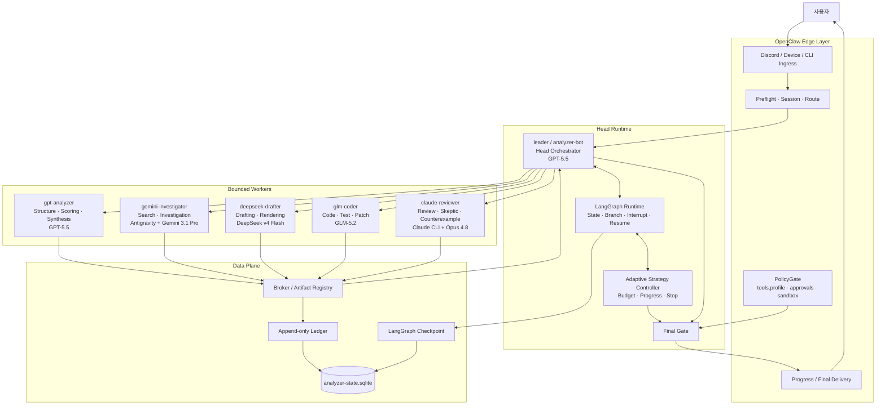

## 3. 시스템 계층

| 계층 | 책임 |
| --- | --- |
| OpenClaw Edge | 메시지 수신, 세션, 기기 연결, 전송, 실제 도구 권한 |
| Head Runtime | 사용자 의도 해석, 분기, 상태, 예산, 전략, 최종 판단 |
| Worker Layer | 분석, 조사, 초안, 코드, 검증 |
| Data Plane | Ledger, artifact, checkpoint, approval, assumption registry |

OpenClaw는 두뇌가 아니다. OpenClaw는 사용자의 메시지를 받고, 권한이 있는 도구를 실행하고, 결과를 다시 전달하는 Edge Runtime이다. 실제 판단의 중심은 `leader / analyzer-bot`이며, LangGraph가 그 판단의 실행 순서와 상태 전이를 관리한다. LangChain은 오케스트레이터가 아니라 각 Worker를 동일한 인터페이스로 감싸는 구성 요소로 사용한다.

```text
OpenClaw  = 입출력과 실제 실행
LangGraph = 상태 머신과 오케스트레이션
LangChain = 모델·도구·Worker wrapper
Head      = 판단과 책임의 주체
```

OpenClaw에 연결되는 에이전트는 **leader 하나뿐이다.** Worker들은 OpenClaw 에이전트가 아니라 Head 런타임 내부의 LangChain 래핑 라우트다.

## 4. 단일 Head 원칙

### 4.1 leader / analyzer-bot

```yaml
agent_id: leader
alias: analyzer-bot
openclaw_profile_id: analyzer
role: head_orchestrator
model_route: gpt-5.5
```

leader는 시스템의 유일한 대화 주체이며, 유일한 최종 판단 주체다.

주요 책임: 사용자 요청 해석, canonical conversation state 소유, 목표와 제약 추출, task decomposition, task class 결정, risk tier 결정, Worker 선택과 호출, 예산 배분, strategy family 선택, 승인 요청, 결과 종합, 중단·재개 판단, 최종 PolicyGate, 최종 사용자 응답.

Leader만 변경할 수 있는 값:

```text
goal · scope · task class · risk tier · budget · method family
core assumptions · worker assignment · approval requirement
suspend / resume · global stop · final response
```

다만 Leader도 무제한 권한을 갖지 않는다. Leader가 할 수 없는 것:

- 자기 판단만으로 hard cap을 늘리는 것 (ASC §2)
- 사용자 승인 없이 high-risk action을 실행하는 것
- Worker 실패를 성공으로 해석하는 것
- Reviewer의 blocking finding을 삭제하는 것
- Grade 3 서술을 검증된 진전으로 계산하는 것 (ASC §6, v0.1 비활성)
- 동일 모델의 반복 호출을 독립 검증으로 계산하는 것

## 5. Worker 역할과 모델 배치

하나의 Leader와 다섯 개의 bounded Worker. `gpt-analyzer`는 Leader의 동료가 아니라 **하위 Worker**다 (routing 문서 §1이 이 이름 충돌과 종속 관계를 고정).

### 5.1 역할 배치

| 역할 | Agent ID | 모델 경로 | 핵심 책임 |
| --- | --- | --- | --- |
| Head | `leader` | GPT-5.5 | 판단·상태·분기·최종 게이트 |
| Analyzer | `gpt-analyzer` | GPT-5.5 | 구조화·채점·종합 |
| Investigator | `gemini-investigator` | Antigravity + Gemini 3.1 Pro | 검색·조사·증거 |
| Drafter | `deepseek-drafter` | DeepSeek v4 Flash | 문서·응답 초안 |
| Coder | `glm-coder` | Z.ai GLM-5.2 | 코드·테스트·패치 |
| Reviewer | `claude-reviewer` | Claude CLI + Opus 4.8 | 반례·검증·차단 |

모델 문자열은 구성값이다. **역할은 설계에 고정하고, 모델 경로는 설정으로 교체 가능하게 한다.** 배치(assignment)는 활성화(activation)가 아니다 — 각 라우트는 smoke 증거로 활성화되며, 비활성 워커는 §19의 degraded 규칙으로 처리된다 (routing §6).

### 5.2 gpt-analyzer

책임: 복잡한 문제 구조화, 요구사항·제약 추출, acceptance criteria 작성, 평가 기준 생성, 여러 결과 비교, coverage·consistency 분석, risk scoring, synthesis 초안.

```text
gpt-analyzer의 점수는 advisory signal이다.
점수는 evidence가 아니다.
점수는 progress grade가 아니다.
점수는 budget extension의 근거가 아니다.
```

Leader와 gpt-analyzer는 같은 GPT-5.5 경로를 사용하므로 두 결과는 상호 독립 검증으로 계산하지 않는다:

```text
leader 판단 + gpt-analyzer 판단 ≠ Grade 2 independent verification
```

컨텍스트 분리는 오류 상관성을 줄이는 데 도움은 되지만, 같은 모델과 같은 자료를 사용한 결과를 독립 증거로 만들지는 못한다.

위임 기준은 §11, 상세 계약은 routing 문서 §2.2.

### 5.3 gemini-investigator

책임: 외부 검색, 원문 확보, 다중 출처 비교, 사실 검증, 상충 자료 탐지, 원인 미상 문제 조사, 가설별 증거 수집, source lineage 기록.

```yaml
access:
  network_read: true
  repository_read: true
  external_write: false
  repository_write: false
  deployment: false
```

반환 필수 필드: `queries`, `sources`, `findings`, `conflicts`, `unverified_claims`, `limitations`, `evidence_refs`.

Gemini는 증거 수집자다. 최종 판단, 사용자 직접 전달, 다른 Worker 호출은 금지. Apify 에스컬레이션 규칙과 `preview`/`blocked`/`failed`/`no_results`/`executed` 상태 구분을 승계한다 (analyzer 문서 searcher 계약).

### 5.4 deepseek-drafter

책임: 사용자 응답·보고서·문서·메시지 초안, tone·format 적용, 검증된 자료의 문장화.

**DeepSeek는 새로운 사실의 출처가 아니다:**

```text
검증된 사실 → DeepSeek → 읽기 쉬운 초안
```

입력은 Head가 승인한 fact set과 artifact로 제한. 반환 계약: `artifact_ref`, `audience`, `tone`, `format`, `source_fact_refs`, `unsupported_claims`, `open_placeholders`. **`unsupported_claims`가 비어 있지 않으면 초안은 자동으로 최종 응답이 될 수 없다.**

### 5.5 glm-coder

책임: 코드 작성·수정, 단위·통합 테스트, migration, 오류 재현, patch 생성, 실행 결과 기록.

```yaml
access:
  repository_read: true
  repository_write: sandboxed
  shell_exec: sandboxed
  tests: true
  network_write: false
  deploy: false
  merge: false
```

반환 필수: `artifact_ref`, `files_changed`, `commands_run`, `tests`, `diagnostics`, `known_failures`, `rollback_plan`. GLM은 스스로 작업 완료를 판정할 수 없다.

```text
GLM이 코드를 만든다.
Claude가 문제를 찾는다.
Leader가 채택 여부를 결정한다.
```

### 5.6 claude-reviewer

책임: 설계-구현 불일치 탐지, 숨은 가정 탐지, 반례 생성, 실패 모드 분석, diff review, 테스트 누락 탐지, source independence 검토, 사용자 의도 왜곡 탐지, security·data-loss 검토, budget laundering 탐지, high-risk 실행 전 blocking review.

판정: `pass` · `pass_with_warnings` · `request_changes` · `blocked`.

```text
Claude pass ≠ 사용자 승인 ≠ PolicyGate 승인 ≠ Leader final gate
```

Claude는 코드를 직접 수정하지 않는다. 수정 요청은 반드시 Head로 돌아온 뒤 새 WorkerCommand로 GLM에게 전달된다:

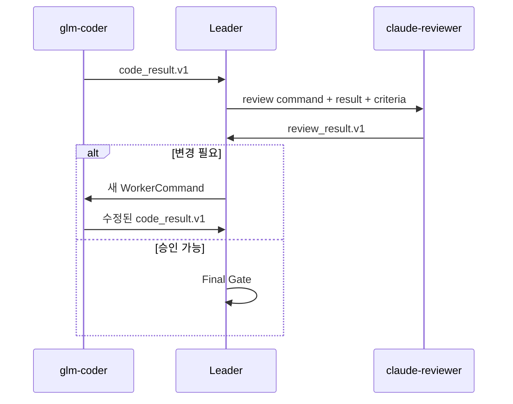

## 6. 권한 매트릭스

| 기능 | Leader | GPT | Gemini | DeepSeek | GLM | Claude |
| --- | ---: | ---: | ---: | ---: | ---: | ---: |
| 사용자와 대화 | O | X | X | X | X | X |
| 목표 변경 | O | X | X | X | X | X |
| Task 분해 | O | 보조 | X | X | X | 검토 |
| 구조 분석 | O | O | 보조 | X | 보조 | 검토 |
| 외부 조사 | 지시 | X | O | X | 제한 | 검증 |
| 코드 작성 | 승인 | X | X | X | O | X |
| 초안 작성 | 승인 | 구조 | 자료 | O | 보조 | 검토 |
| 결과 채점 | 최종 | advisory | X | X | 금지 | 독립 검토 |
| 예산 변경 | O | X | X | X | X | X |
| Worker 호출 | O | X | X | X | X | X |
| 외부 실행 | Final Gate | X | X | X | 제한 | X |
| High-risk 실행 | 사용자 승인 확인 + Final Gate | X | X | X | X | Blocking Review |
| 최종 응답 | O | X | X | X | X | X |

Leader의 high-risk "승인"은 Leader가 임의로 승인한다는 뜻이 아니다. 정확한 의미:

```text
사용자의 명시적 승인 존재 확인
+ Grade 2 검증 확인
+ PolicyGate 확인
+ Leader Final Gate
```

## 7. Worker 간 직접 호출 금지

```text
gemini → glm        금지
glm → claude        금지
claude → gpt        금지
deepseek → gemini   금지
worker → worker     전부 금지
```

모든 통신은 Head와 Ledger를 거친다:

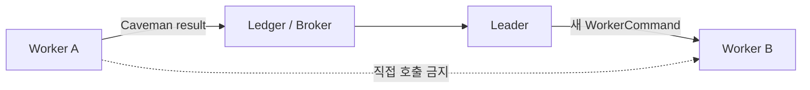

Worker끼리 직접 호출할 수 있으면: 호출 예산의 소유자가 불분명해지고, 누가 목표를 변경했는지 추적 불가하고, Worker가 스스로 scope를 확장하고, Reviewer가 구현자를 직접 조종하고, 재시도 횟수와 실패 계보가 사라지고, 사용자 승인 우회 가능성이 커지고, canonical state와 실제 실행이 달라진다.

Worker가 다른 역할의 작업이 필요하다고 판단하면 exception channel을 사용한다 (§8).

## 8. Control Plane과 Data Plane

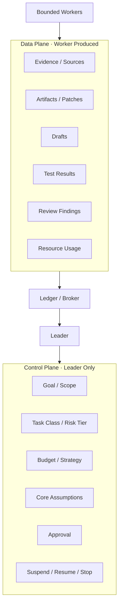

**Control Plane** (Head만 변경): goal, scope, task class, risk tier, budget, method family, assumption, approval, worker assignment, stop status, final response.

**Data Plane** (Worker 생산): evidence, source, artifact, patch, draft, test result, diagnostic, review finding, progress claim, resource usage.

Worker가 Control Plane 변경 필요성을 발견해도 직접 수정할 수 없다. 다음 exception channel 중 하나를 올린다:

```text
needs_clarification · schema_mismatch · out_of_scope_finding
assumption_violation · novel_observation
```

**Exception은 경보이지 권한 상승 통로가 아니다.** (하드 리밋은 analyzer 문서 Caveman 절: 예산 자동 증가 없음, out_of_scope_finding은 report-only, 반복 exception은 attempt와 동일하게 예산 소모.)

## 9. Caveman Contract

Head와 Worker 사이의 메시지는 자유서술 문자열이 아니라 typed envelope을 사용한다. 목적은 이중이다: **계약 강제** — Worker가 자유서술 한 문장으로 성공을 주장하거나 schema를 우회하지 못하게 하는 것 — 그리고 **토큰 최소화** — bounded contract와 context projection(§20)이 결합해 각 호출이 최소 컨텍스트만 주고받게 하는 것. 통신 주체는 항상 Head↔Worker다. Worker↔Worker Caveman 채널은 존재하지 않는다 (§7).

### 9.1 공통 Envelope

```ts
interface CavemanEnvelope<TPayload> {
  schema: string;
  schemaVersion: number;
  messageId: string;
  taskId: string;
  lineageId: string;
  attemptId: string;
  producer: AgentRole;
  status: "ok" | "partial" | "blocked" | "failed" | "cancelled";
  payload: TPayload;
  evidenceRefs: string[];
  artifactRefs: string[];
  exceptions: ContractException[];
  resourceUsage: {
    inputTokens?: number;
    outputTokens?: number;
    toolCalls?: number;
    elapsedMs?: number;
    estimatedCostUsd?: number;
  };
}
```

`lineageId`와 `attemptId`가 envelope에 있어서 모든 Worker 결과가 ASC의 lineage·attempt 계보에 기계적으로 묶인다 — Head가 결과를 계보에 수동으로 배정하는 판단 지점 자체가 없다. `exceptions`는 배열이다: 한 결과가 `schema_mismatch`와 `novel_observation`을 동시에 올릴 수 있다.

### 9.2 Payload 종류

```text
analysis_result.v1 · research_result.v1 · draft_result.v1
code_result.v1 · review_result.v1 · device_result.v1 · generic_result.v1
```

필드 수준 스키마는 routing 문서 §8.

### 9.3 generic_result 제한

`generic_result.v1`은 비상 호환 통로다. 다음 용도로 사용할 수 없다: `status: ok`, completion evidence, progress evidence, budget extension evidence, resume evidence, success verdict. **Generic result는 항상 partial 또는 blocked로 취급한다.** 이 제한이 없으면 Worker가 typed schema를 우회해 자유서술 한 문장으로 성공을 주장할 수 있다.

## 10. Task Class와 예산

Task class는 대화 단위가 아니라 Head가 dispatch한 **개별 task unit마다** 지정한다. 우선순위 (첫 일치 선택, lineage 시작 시 동결 — ASC §9):

```text
1. high_risk_action   2. code_change   3. investigation   4. simple_query
```

### 10.1 기본 예산 (canonical: ASC §9)

| Task Class | Token | 시간 | 비용 | Tool Calls | Strategy Switch |
| --- | --: | --: | --: | --: | --: |
| simple_query | 8K | 45초 | $0.15 | 4 | 1 |
| code_change | 64K | 15분 | $2.00 | 40 | 2 |
| investigation | 96K | 25분 | $3.00 | 30 | 4 |
| high_risk_action | 32K | 10분 | $1.50 | 15 | 1 |

High-risk task는 예산이 남아도 세 조건 없이는 실행되지 않는다:

```text
Grade 2 independent verification + explicit user approval + PolicyGate pass
```

### 10.2 역할별 예산

v0.1에서는 별도의 per-role hard cap을 두지 않는다.

```text
task-class hard cap  = 실제 강제
per-role usage       = 계측만 (Ledger 기록)
per-role hard cap    = v0.2 후보 (운영 로그 기반)
```

## 11. gpt-analyzer 위임 기준

Leader가 모든 문제를 gpt-analyzer에게 넘기면 비용과 지연이 커진다. 반대로 모든 분석을 inline으로 수행하면 역할 분리의 의미가 줄어든다. v0.1 기본 규칙 (canonical: routing §2.2):

**Leader inline**: 단일 단계 simple_query, 추가 Worker 결과 없음, 복수 결과 비교 불필요, 별도 acceptance criteria 불필요, high-risk 아님.

**gpt-analyzer 호출**: investigation / code_change / high_risk_action, 복수 Worker 결과 비교, 평가 기준·acceptance criteria 생성, 구조적 충돌 분석, coverage·risk scoring.

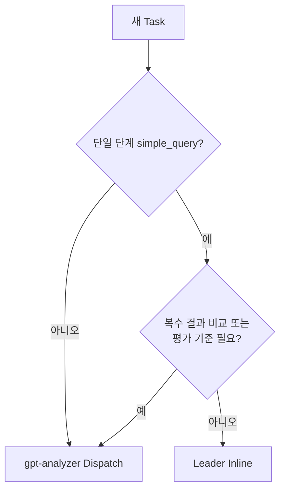

## 12. 기본 라우팅

### 12.1 Simple Query

```text
User → Leader → (필요할 때만 GPT Analyzer) → Final Gate → User
```

### 12.2 Investigation

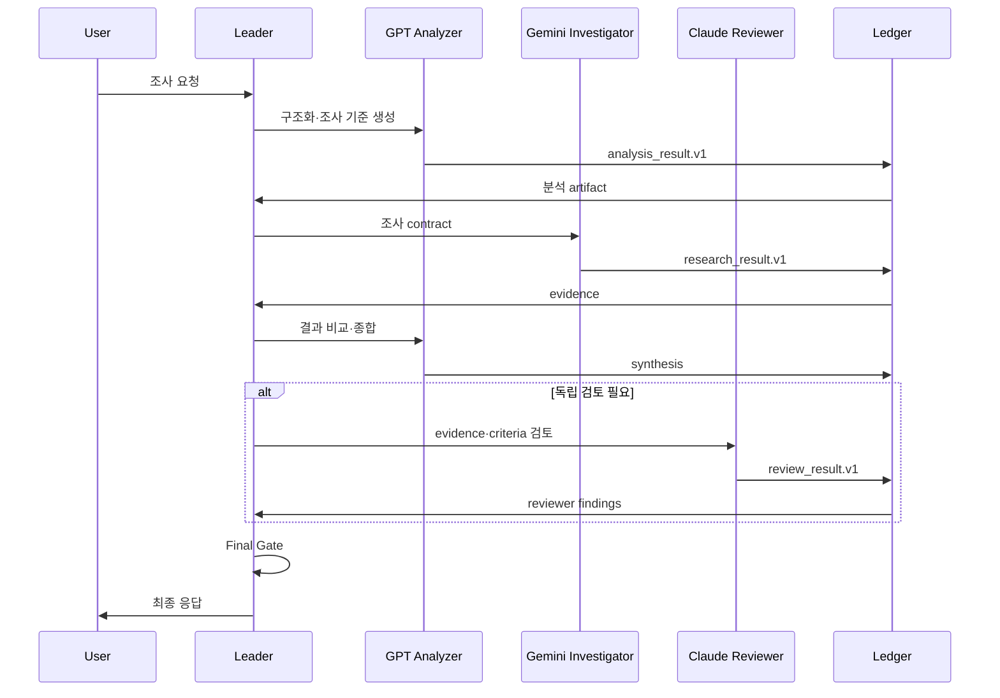

### 12.3 Code Change

```text
Leader → GPT Analyzer(요구사항·acceptance criteria)
       → GLM Coder(구현·테스트)
       → Claude Reviewer(diff·테스트·반례)
       → Leader → 필요 시 GLM 재호출 → Final Gate
```

### 12.4 Drafting

```text
Leader → GPT Analyzer(구조) → Gemini(사실 조사)
       → DeepSeek(초안) → Claude(왜곡·누락 검토) → Leader(최종 편집)
```

라우팅 패턴은 예산 클래스가 아니다 — drafting task의 예산 클래스는 분류기가 정한다 (routing §5).

### 12.5 High-risk Action

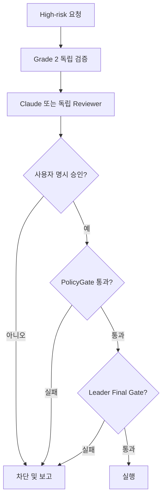

## 13. Reviewer Risk Tier

Reviewer에게 모든 원문을 항상 제공하면 비용과 정보 오염이 증가한다. 반대로 중요한 작업에서 Head가 만든 contract만 주면, Head의 의도 해석 오류를 Reviewer가 발견할 수 없다. 따라서 risk tier에 따라 입력을 **누적** 확장한다 (canonical: routing §2.6):

```text
Low:    Head contract + worker result + evaluation criteria
Medium: Low 입력 + 관련 원문 발췌
High:   Medium 입력
        + original user request
        + independently generated intent digest
        + Head contract (side-by-side 비교)
```

High tier는 Low tier를 대체하지 않는다 — worker result와 evaluation criteria는 모든 tier에 포함된다.

독립 intent digest는 기존 `llm-task`를 사용하며 별도 상시 Agent로 만들지 않는다.

```text
Digest 입력:      original user request + fixed extraction schema + 최소 원문 컨텍스트
Digest 입력 금지: Head contract · Head intent summary · Head conclusion · Worker result
```

Head의 압축 결과를 다시 요약하는 것은 독립 재해석이 아니다.

## 14. 독립 검증

독립성은 모델 이름이 아니라 **오류 상관성을 낮추는 경로**로 판정한다 (canonical: ASC §6).

```text
강한 축: source_lineage · data_partition · verification_method · toolchain
약한 축: model_provider · prompt_context · sampling_path · evaluator_instance

Grade 2 = 강한 축 1개 이상, 또는 약한 축 2개 이상
```

| 조합 | Grade 2 여부 | 이유 |
| --- | --- | --- |
| Leader + GPT Analyzer | 불가 | 동일 모델 경로 |
| Gemini 검색 + Claude 코드 검증 | 가능성 있음 | source/toolchain 차이 |
| Gemini와 Claude가 동일 문서만 재독해 | source_lineage 독립 아님 | 같은 upstream |
| 같은 모델, 다른 prompt만 | 약한 축 1개 | 부족 |
| 다른 모델 + 다른 prompt | 약한 축 2개 | 조건부 가능 |
| 독립 데이터 + 다른 검증 방법 | 가능 | 강한 축 존재 |

## 15. Adaptive Strategy Controller

ASC는 답을 생각하는 계층이 아니라, **어떤 전략을 계속 유지할지 중단할지 판단하는 계층**이다.

```text
Object reasoning:  문제를 어떻게 풀 것인가?
Strategy control:  이 방법을 계속 써도 되는가?
```

### 15.1 Method 상태 (canonical: ASC §7)

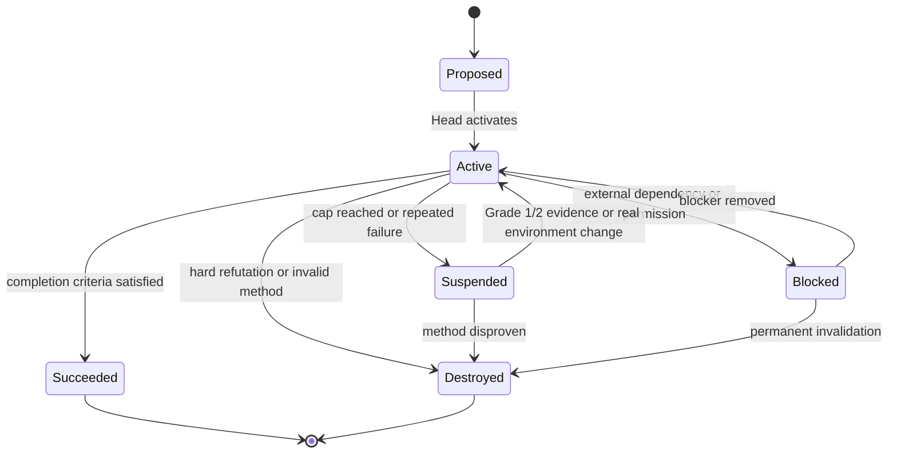

**Suspended가 기본 중단 상태다.** Destroyed는 다음 경우에만: 핵심 가정이 직접 반박됨, 방법 자체가 논리적으로 불가능, 안전상 사용 불가, 필수 도구·데이터와 구조적 비호환. `Blocked → Active`는 blocker 제거만으로 복귀한다 — 이는 ASC §4 복구 표의 "환경 변화" 트리거와 동일 사건이다.

### 15.2 Attempt Credit (canonical: ASC §4-5)

```text
기본 method credit:        3.0
Lineage 전체 누적 최대:     4.0
```

사용자 승인도 reset이 아니라 **delta**다:

```text
현재 allowance 3.0 · 사용자 +0.5 승인 → 새 allowance 3.5
현재 lineage allowance 3.7 · 사용자 +1.0 승인 → 실제 허용 delta 0.3
```

승인이 할 수 없는 것: attempt count 초기화, strategy switch count 초기화, failure history 삭제, lineage 새로 위장, 4.0 초과.

### 15.3 변경별 Credit

| 변경 | Credit |
| --- | --- |
| 실행 변형 | 0.2 |
| 증거 정책 변경 | 0.5 |
| 동일 가정 내 operator family 변경 | 0.8 |
| representation 변경 | 새 local method |
| core assumption 변경 | 새 method family |

복수 변경이 동시에 발생하면 합산하지 않고 가장 큰 값만 적용한다.

### 15.4 실패 반복

동일한 failure signature가 **독립적으로 2회** 확인되면 조기 중단할 수 있다.

Failure signature의 canonical 필드는 ASC §3(`violated_constraint` / `failed_test` / `failure_stage` / `counterexample`)이고, 코드·실행 작업에는 선택적 `execution` 하위 레코드로 구체화한다:

```yaml
failure_signature:
  violated_constraint:
  failed_test:
  failure_stage:
  counterexample:
  execution:            # optional, code/execution tasks
    command:
    stage:
    error_code:
    error_message:
    environment:
  assumption_ids: []
  method_family:
```

문구만 조금 달라지고 실패 단계와 원인이 같으면 같은 실패로 계산한다.

### 15.5 Progress Grade (canonical: ASC §6)

| Grade | 의미 | v0.1 처리 |
| --- | --- | --- |
| 1 | 외부 검증 가능한 진전 | 인정 |
| 2 | 독립 교차 검증된 진전 | 인정 |
| 3 | 구조적·사전등록 진전 | 기록만, 비활성 |
| 4 | 서술·자기평가 | 인정 안 함 |

Grade 3는 v0.1에서 `provisional`로만 저장하며 다음 근거가 될 수 없다: progress, completion, budget extension, resume, same-failure confirmation, high-risk execution.

## 16. Core Assumption Registry

canonical 스키마와 트랜잭션 규칙은 ASC §3. 요점:

- 각 attempt는 자유서술 가정이 아니라 `assumptionId[]`를 참조한다.
- 동일 `(scope_type, scope_id, normalized_hash)`는 두 번째 ID를 받을 수 없다 (`UNIQUE` 제약).
- 한 registry에는 하나의 normalization version만 활성화된다.
- 일반 write: `BEGIN IMMEDIATE` → metadata version 검증 → insert → COMMIT.
- Migration: scope 전체 재정규화 → hash 재생성 → collision 검사 → metadata version 갱신, 전부 한 트랜잭션. **Collision 발생 시 전체 rollback — 두 assumption ID를 조용히 합치지 않는다.** 기존 attempt가 두 ID를 각각 참조하고 있을 수 있기 때문이다.

## 17. StateStore와 Ledger

```text
Canonical storage: ${agentDir}/analyzer-state.sqlite
현재 배치:          ~/.openclaw/agents/analyzer/agent/analyzer-state.sqlite
```

기존 `openclaw-agent.sqlite`는 수정하지 않는다.

주요 테이블: `ledger_events`, `graph_checkpoints`, `artifacts`, `approval_tokens`, `core_assumptions`, `core_assumption_aliases`, `core_assumption_registry_meta`.

```text
ledger_events     = canonical (source of truth)
graph_checkpoints = cache
```

Checkpoint가 누락·노후되어도 데이터 손실로 처리하지 않고 Ledger replay로 재생성한다:

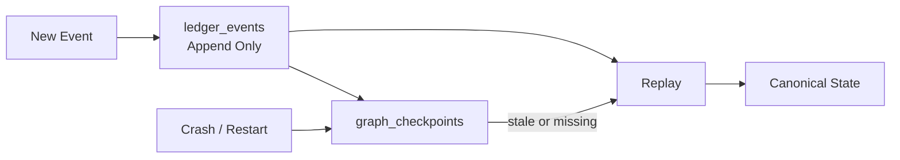

## 18. Final Gate

최종 응답 또는 실행 전에 Leader가 순서대로 검사한다 (canonical: routing §10):

```text
1.  task lineage와 task class 일치
2.  Caveman schema·version 유효
3.  Worker role scope 준수
4.  evidence·artifact 존재
5.  generic_result / Grade 3 우회 없음
6.  budget·strategy switch cap 잔여
7.  Reviewer blocking issue 해결
8.  필요 independence 수준 충족
9.  high-risk면 사용자 승인 존재
10. PolicyGate 도구 허용
11. delivery 전 canonical ledger event 기록
```

하나라도 실패하면 성공 경로로 진행하지 않는다.

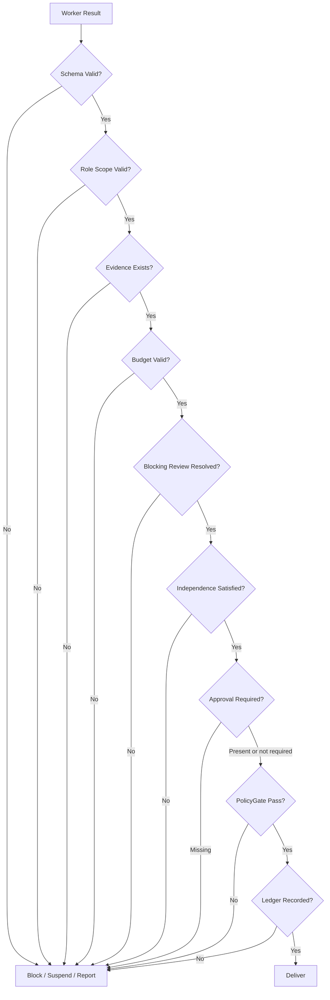

## 19. 모델 가용성과 Fallback

각 역할 상태: `available` · `degraded` · `unavailable`. Fallback은 역할과 독립성 판정을 망치지 않는 경우에만 허용된다 (canonical: routing §6):

| 장애 | 처리 |
| --- | --- |
| Leader 모델 장애 | 명시적 route 변경 event |
| GPT Analyzer 장애 | Leader inline 가능, 독립 검증으로 계산 금지 |
| Gemini 장애 | 조사 완료 주장 금지, blocked |
| DeepSeek 장애 | Leader 직접 draft 가능, fallback event 기록 |
| GLM 장애 | 다른 Worker의 몰래 coder 역할 수행 금지 |
| Claude 장애 | non-independent review 강등 가능, Grade 2 불산정 |
| Claude 장애 + high-risk | 독립 경로 없으면 실행 차단 |

Ledger event: `model_route_changed`, `worker_availability_changed`, `review_independence_degraded`, `fallback_activated`.

## 20. Context Projection

Worker에게 전체 대화를 무조건 제공하지 않는다 (canonical: routing §7):

| 역할 | 받는 정보 |
| --- | --- |
| Leader | 전체 canonical state |
| GPT Analyzer | task contract, 관련 원문, evidence, criteria |
| Gemini | 조사 질문, source 기준, 시간 범위 |
| DeepSeek | 검증된 fact set, tone, audience, format |
| GLM | acceptance criteria, repo scope, 허용 파일, test command |
| Claude | risk tier별 (§13) — contract, result, criteria, 원문 |

목적: 역할 이탈 방지, 개인정보 노출 축소, Head 결론에 대한 anchoring 방지, **비용·토큰 절감**, 독립 검증 유지, prompt injection 영향 축소.

## 21. 구현 저장소 전략

설계 저장소와 구현 저장소의 책임을 분리한다.

```text
mixed-framework    설계 source of truth — 역할·권한, Caveman contract, ASC 정책, routing, 구현 순서
openclaw-upstream  실제 runtime 코드 — SQLite, LangGraph, OpenClaw adapter, Discord ingress, Worker adapters, tests
```

**기존 `head-transition-v01` 스파이크는 오래된 베이스 위에 있으므로 구현 기준 branch로 사용하지 않는다:**

```text
최신 upstream main
  → clean clone
  → 새 구현 branch
  → 스파이크 9개 파일 선별 이식
  → 최신 API 기준 수정
```

기존 스파이크 branch는 donor/reference로 보존한다. (analyzer 문서의 Verified Spike 절은 증거 기록으로 유효하되, 구현 기준이 아니다.)

### 차용 결정 (Adopted Components, 2026-08 조사)

원칙은 7/31 노트와 동일 — 플랫폼이 아니라 패턴을 흡수한다. 단 아래 항목은 우리가 쓸 코드를 실제로 지우므로 **런타임 채용**한다. 신규 서비스 의존은 LiteLLM 하나로 억제한다.

| 구성요소 | 판정 | 지워지는 작업 |
| --- | --- | --- |
| **LiteLLM** (self-host 게이트웨이, Apache 2.0) | 채용 — 유일한 신규 서비스 의존 | `ModelRoute`/`Availability`/fallback/비용 계측 자작(P2·P5). **역할당 API 키 1개**를 발급하면 §10.2의 per-role usage metering이 게이트웨이 기능으로 충족된다 |
| **LangGraph JS `SqliteSaver`** | 채용 | `graph_checkpoints` 저장 계층 자작(P3의 절반). ⚠️ checkpointer SQLi→RCE 취약점 공개 이력(2026, Check Point) — **패치 버전 고정 필수** |
| **Zod** | 채용 | Caveman runtime validator의 기반(P1) |
| **promptfoo** | 채용 (7/31 노트에 이미 있음) | P6 adversarial/회귀 테스트 하네스 |
| **OpenClaw sandbox tool policy** | 채용 (기존 기능) | `glm-coder`의 `sandboxed` 실행. Microsandbox(libkrun microVM)는 격리 강도가 부족할 때만 v0.2에서 검토 |
| **Langfuse / traceAI** (OTel LLM 트레이싱) | 조건부 | P7 Shadow Mode 비교 대시보드 자작. Ledger가 canonical이고 트레이싱은 ops 뷰라는 경계 유지 |
| **Vercel AI SDK** | 플랜 B | LiteLLM 셋업이 막히면 in-process 프로바이더 통일로 대체. 단 비용 추적·fallback은 자작으로 되돌아옴 |
| **A2A · Temporal · Pydantic AI** | 참조만 | A2A는 worker 간 통신 표준이라 §7 설계 위반, Temporal은 두 번째 워크플로 플랫폼(7/31 keep-out 정신), Pydantic AI는 Python — Zod가 TS 등가물 |

## 22. 구현 로드맵

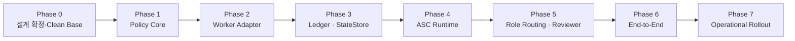

### Phase 0 — 설계와 기준점 확정

목표: 문서 PR 완료, 최신 main 기준 clean clone 확보, 스파이크 donor 전환, 관련 AGENTS.md 확인, 테스트 환경 확정.

완료 조건: 설계 문서 간 모순 없음, broken links 0, stale 문구 0, 최신 main SHA 기록, dirty checkout 미사용.

### Phase 1 — Policy Core

구현: CavemanEnvelope, role payload, runtime validator (Zod 기반 — §21 차용 결정), generic_result 제한, Grade 3 제한, task class, budget config, assumption registry, normalization migration, unit tests.

완료 조건: schema mismatch 차단, generic success 우회 차단, Grade 3 extension 차단, task class 동결, assumption 중복 차단, migration rollback.

### Phase 2 — Worker Adapter

구현: legacy WorkerCommand/WorkerResult adapter, Caveman canonical path, schema negotiation, cancellation·late result 보존, adapter usage 기록(ledger 이벤트 발행은 Phase 3의 Ledger 착지 후 연결). 모델 라우트는 LiteLLM 게이트웨이 경유 — 라우트 등록, fallback, availability, 비용 계측은 게이트웨이에 위임하고 어댑터는 역할 계약만 소유한다 (§21 차용 결정).

완료 조건: legacy 호환, unknown schema 차단, 자유서술 fallback 금지, generic result 성공 변환 금지.

**활성화 순서**: 어댑터는 `glm-coder`부터 시작한다 — 유일하게 게이트 없는 건강한 라우트 후보이며, degraded 로스터(§19)로 Phase 6 세로 슬라이스를 먼저 관통할 수 있다. 나머지 어댑터는 라우트 smoke 통과 순서대로 활성화하며, 권장 순서는 `claude-reviewer` 우선 (Grade 2와 high-risk 게이트가 독립 검증 경로에 걸려 있으므로, routing §6).

### Phase 3 — StateStore와 Ledger

구현: StateStore interface, InMemoryStateStore, SQLiteStateStore, append/replay, checkpoint rebuild, idempotency, artifact registry, approval token, cancellation, delivery receipt. checkpoint 저장은 LangGraph `SqliteSaver` 채용 — 자작 대상은 `ledger_events`와 그 replay뿐이다 (§21 차용 결정).

완료 조건: crash 후 replay, stale checkpoint 복구, duplicate event 차단, cancel 후 late result 거부, 기존 OpenClaw DB 무수정, **checkpointer 패치 버전 고정 확인**.

### Phase 4 — ASC Runtime

구현: frozen attempt_spec, append-only attempt_outcome, attempt credit, failure signature, strategy switch, local/global stop, suspension, manual extension, force resume audit, inheritance record.

완료 조건: 3.0 stop, 4.0 lineage clamp, 같은 실패 2회 조기 stop, self-extension 차단, resume 세탁 차단, representation 세탁 차단.

### Phase 5 — 역할·모델 라우팅

구현: AgentRegistry, AgentRole, ToolProfile, ModelRoute, Availability, context projection, role-based dispatch, independence evaluator, reviewer tier, intent digest, Final Gate.

완료 조건: worker 간 호출 불가, Leader 외 user delivery 불가, GPT score progress 사용 불가, Gemini source 없는 결과 차단, DeepSeek unsupported claim 차단, GLM scope 초과 차단, Claude artifact 수정 불가.

### Phase 6 — End-to-End Vertical Slice

최종 경로:

```text
Discord ingress → Leader → task classification → WorkerCommand → Worker
→ WorkerResult → Validator → ASC → Ledger → Checkpoint → Final Gate
→ Delivery Receipt
```

필수 시나리오: ① 정상 조사 요청 ② 정상 코드 변경 ③ malformed result ④ generic success 우회 ⑤ Worker timeout ⑥ cancel 후 late result ⑦ restart 후 replay ⑧ stale checkpoint ⑨ 승인 없는 high-risk ⑩ 독립 검증 없는 high-risk ⑪ background cap 도달 stop report. (adversarial 시나리오 하네스는 promptfoo — §21 차용 결정.)

**첫 관통은 degraded 로스터로 한다.** leader + `glm-coder` 두 라우트만으로 §19 fallback 규칙 하에 시나리오 ②·③·⑦을 먼저 통과시킨다 — 이 구성은 설계상 이미 합법이며, 1일 목표다. 나머지 워커는 라우트 smoke 통과 순서대로 활성화하고 시나리오를 증분 확장한다.

### Phase 7 — 운영 배치

```text
Shadow mode → Read-only assist → Low-risk automation
→ Code sandbox → Approval-gated action → Limited high-risk
```

- **Shadow Mode**: 실제 응답·실행은 기존 경로가 처리하고, 새 Head는 뒤에서 같은 요청을 분석. 비교 항목 — task classification, worker selection, budget estimate, final verdict, failure detection.
- **Read-only Mode**: 검색·분석·검토만 허용.
- **Sandboxed Code Mode**: GLM이 sandbox에서 코드·테스트를 수행하되 merge·deploy 금지.
- **Approval-gated Mode**: 외부 전송·배포·삭제는 사용자 승인 + Final Gate 요구.

## 23. 테스트 전략

**단위**: schema validation, task classification, progress grade, independence, budget clamp, failure signature, assumption normalization, context projection, role authority.

**통합**: Worker adapter, Ledger replay, SQLite concurrency, migration rollback, late result, cancellation, PolicyGate, approval token.

**E2E**: ingress부터 delivery까지, restart recovery, degraded provider, high-risk block, manual extension, global stop.

**Adversarial**:

- Generic result로 성공 위장
- Worker가 다른 Worker 호출 시도
- Reviewer가 artifact 수정 시도
- Drafter가 출처 없는 사실 삽입
- Coder가 허용 파일 밖 수정
- Leader가 동일 모델을 독립 검증으로 계산
- Suspend 후 새로운 lineage인 척 재시도
- assumption 문구만 바꿔 중복 등록
- failure message만 바꿔 attempt reset
- 사용자 승인 없이 high-risk 실행

## 24. v0.1에서 만들지 않는 것

```text
동적 Worker 생성 · Worker 간 직접 협상 · Worker self-routing
자동 모델 tournament · 모델 성능 기반 자동 역할 교체
항상 켜진 Reviewer chain · Grade 3 활성화 · preregistered claim registry
inheritance 자동 소비 · adaptive threshold tuning
expected information gain stop rule · Kafka / RabbitMQ · Vector DB
독립된 Research Service · Reviewer의 코드 직접 수정
```

## 25. v0.2 후보

역할별 token/cost hard cap, Claude unavailable 시 고정 substitute, Antigravity tool policy enforcement 검증, Tester 역할 분리, Device Agent 복귀, Operator 역할 복귀, Grade 3 claim registry, inheritance 소비, adaptive strategy selection, shadow-table assumption migration, 자동 model routing, evidence quality calibration.

## 26. 최종 완료 정의

다음 조건을 모두 충족해야 v0.1 완료로 판정한다:

```text
단일 Leader만 사용자와 대화
다섯 Worker가 bounded contract로 작동
Worker 간 직접 호출 불가
Caveman typed contract 적용
generic_result 우회 차단
Grade 3 우회 차단
Task class와 budget 동작
ASC stop/resume 동작
SQLite Ledger replay 동작
Checkpoint 복구 동작
Assumption registry 동작
Reviewer tier 동작
Independent intent digest 격리
High-risk 3중 gate 동작
최종 delivery 전 ledger 기록
E2E 테스트 통과
Clean main
문서와 구현 불일치 없음
```

## 27. 최종 시스템 흐름

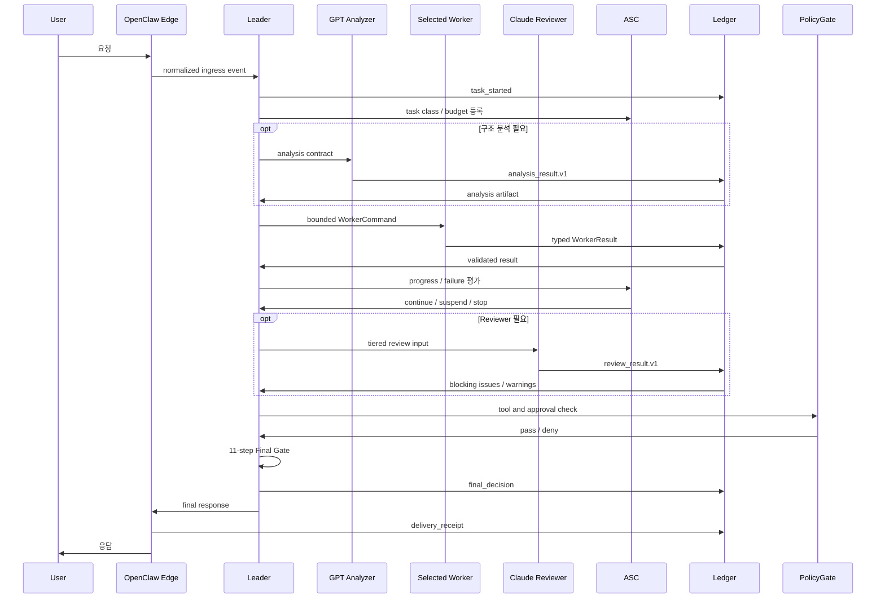

## 최종 요약

```text
GPT Analyzer는 구조를 만든다.
Gemini는 증거를 찾는다.
DeepSeek는 문장을 만든다.
GLM은 코드를 만든다.
Claude는 의심하고 검증한다.
Leader만 결정하고 사용자에게 답한다.
```

전체 시스템의 핵심은 모델 수가 아니다. 핵심은 네 가지다:

```text
권한은 Head에 집중한다.
작업은 Worker에 분산한다.
증거는 Ledger에 남긴다.
실행은 Final Gate를 통과한다.
```

## References

- [Mixed Framework Orchestration Plan](../../README.md)
- [Analyzer-bot Main Agent Design](../2026-08-01-analyzer-bot-main-agent-design.md) — 호스트 구조, Caveman 계약, PolicyGate, Verified Spike
- [Adaptive Strategy Controller](../2026-08-02-adaptive-strategy-controller.md) — 등급, 독립성 축, 예산, stop/resume (canonical)
- [Head Role and Model Routing v0.1](head-role-model-routing-v01.md) — 역할 레지스트리, 권한 매트릭스, fallback, final gate (canonical)
